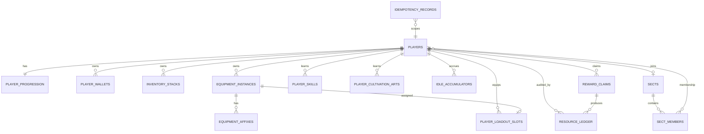

# Roadmap phát triển và kiến trúc PostgreSQL

**Trạng thái:** APPROVED SUPPLEMENT — không thay thế roadmap `LOCKED` hiện tại  
**Phạm vi:** phân tích kiến trúc và kế hoạch; chưa triển khai code/migration  
**Nguồn:** toàn bộ Markdown trong `docs`, source hiện tại và JSON/config hiện tại; không sử dụng Git history

## 1. Kết luận phân tích hiện trạng

Project đã có nền tảng data-driven khá rõ: JSON là nguồn chuẩn cho template/game content; GameData được load/validate một lần; runtime tách khỏi template; battle chạy in-memory; application/Discord không được chứa business logic. Core Data v2.1 còn định hình DSL `Effect -> Event -> Action -> Formula/Modifier`, phù hợp mục tiêu effect-driven.

Các phần đã có code gồm player, cultivation/breakthrough, inventory/equipment/skills, sect, exploration, secret realm, shop, craft, exchange, gathering, reward runtime và battle simulation. PostgreSQL hiện được truy cập bằng `pg`; schema được tạo tại startup; một số mutation đã dùng transaction và `SELECT ... FOR UPDATE`.

Các rủi ro cần xử lý trước khi mở rộng:

- Schema runtime đang dồn nhiều aggregate vào bảng `players` và trộn stack item/equipment trong `player_items`.
- Currency data-driven nhưng persistence hardcode thành cột.
- Tu luyện offline đã chuyển sang rate theo phút, không giới hạn thời gian; overflow sau ngưỡng nhận 20%, collect khóa player và commit checkpoint atomically.
- Không có idempotency record cho Discord retry/multi-worker.
- Timestamp đang dùng `TIMESTAMP` thay vì `TIMESTAMPTZ`.
- DDL chạy trong bootstrap, chưa có migration history chính thức.
- Realm có dữ liệu stage nhưng runtime không lưu stage.
- Linh căn đang hardcode trong service, chưa có domain data.
- Contract kỹ năng v1/v2 chưa được chốt; xem `Q-SKILL-001`.

## 2. Nguyên tắc kiến trúc mục tiêu

### 2.1 Ranh giới module

```text
Discord adapter / Application
        -> Use-case services (business logic, framework-agnostic)
        -> Domain policies / Effect & Reward orchestration
        -> Repository interfaces + Unit of Work
        -> PostgreSQL adapters

Static JSON -> Loader -> Validator -> immutable GameData registry
Runtime DB  -> Repositories -> Runtime aggregates
Runtime aggregates + GameData -> BattleEntityFactory -> in-memory Battle
```

- Discord chỉ ánh xạ interaction thành command DTO và render response.
- Service không import `discord.js`, không đọc JSON trực tiếp, không tự mở connection.
- Repository không quyết định gameplay. Transaction boundary bằng `UnitOfWork`/application use case là phương án đề xuất; chưa áp dụng cho đến khi `Q-TRANSACTION-001` được giải quyết.
- Battle không query PostgreSQL, không đọc file, không trao reward.
- Static content tiếp tục ở JSON theo quyết định đã khóa; PostgreSQL lưu identity, ownership, mutable state, ledger và checkpoint.

### 2.2 Data-driven, Effect-driven, Modular

- **Data-driven:** template ID/reference nằm trong JSON; runtime chỉ lưu ID và state biến đổi.
- **Effect-driven:** content mới ghép từ Event, Condition, Action, Formula, Modifier và Target registry. Chỉ action/effect type thật sự mới cần executor code.
- **Modular:** mỗi feature sở hữu service, repository port, adapter và test riêng; giao tiếp liên module bằng DTO/domain event sau commit.
- **Backward compatibility:** legacy schema/data đi qua mapper/normalizer; không sửa JSON để khớp code.
- **Extension registry:** executor registry ánh xạ `actionType -> executor`, không `if (skillId)` hoặc `switch (effectId)` trong core.

## 3. Lazy Evaluation không Redis

### 3.1 Mô hình accumulator

Mỗi nguồn idle được biểu diễn bằng checkpoint, không có tick job:

```text
elapsed = max(0, min(now, accrual_started_at + cap) - checkpoint_at)
gross   = rate(snapshot/config, checkpoint_at..now) * elapsed
claim   = floor/round(gross + carried_fraction) theo policy đã phê duyệt
```

`preview` chỉ tính và không ghi. `claim/settle` chạy trong một transaction:

1. Insert/claim `operation_id` vào idempotency table.
2. Lock accumulator/player row bằng `SELECT ... FOR UPDATE`.
3. Lấy `now` một lần từ TimeProvider (hoặc `transaction_timestamp()`), không gọi thời gian rải rác.
4. Tính elapsed đã clamp bởi cap và policy unlock/pause.
5. Áp reward/cultivation và cập nhật checkpoint trong cùng transaction.
6. Ghi ledger/audit event.
7. Lưu response idempotent và commit.

Hai request đồng thời sẽ serialize trên cùng accumulator row. Request thứ hai nhìn thấy checkpoint mới và nhận `0`, hoặc trả lại response cũ nếu cùng `operation_id`.

### 3.2 Không dùng scheduler cho reset thường kỳ

Daily/weekly/monthly limit dùng `period_key` được suy ra khi request tới. Không cần job reset row về 0. Ví dụ unique key `(player_id, subject_type, subject_id, period_type, period_key)`. Scheduler chỉ dành cho sự kiện có thời điểm thực sự như mở world boss; logic claim vẫn lazy/idempotent.

### 3.3 Thay đổi rate giữa hai lần claim

Không thể tự chọn semantics khi equipment/art/talent thay đổi. Hai mô hình có thể dùng:

- **Settle-before-change:** transaction settle theo rate cũ rồi đổi loadout, sau đó checkpoint mới dùng rate mới. Chính xác và dễ audit.
- **Current-rate-for-whole-window:** đơn giản nhưng có exploit đổi trang bị ngay trước claim.

Thiết kế đề xuất sử dụng settle-before-change, nhưng chỉ triển khai sau khi `Q-CULT-002`/`Q-IDLE-002` được giải quyết.

## 4. Kiến trúc dữ liệu PostgreSQL đề xuất

### 4.1 Quy ước chung

- ID runtime và numeric mapping chờ `Q-DB-002`; Discord user/guild ID lưu `TEXT`.
- Timestamp: `TIMESTAMPTZ NOT NULL`, giá trị UTC.
- Amount/currency/cultivation: `NUMERIC(30, 6)` hoặc scale cụ thể theo data; không chuyển qua JavaScript `Number` nếu có thể vượt safe integer.
- Template ID: `TEXT`, validate qua GameData ở startup/use case; không thể tạo FK trực tiếp từ PostgreSQL tới JSON.
- Mỗi mutable aggregate có `version BIGINT NOT NULL DEFAULT 0` cho optimistic concurrency/read model; mutation nóng vẫn dùng row lock.
- `CHECK amount >= 0`, unique constraint và partial index bảo vệ invariant ở DB.
- JSONB chỉ dùng cho snapshot/audit hoặc payload extension không cần invariant cốt lõi; không dùng thay thế mọi cột domain.

### 4.2 ER mức aggregate



### 4.3 Bảng core runtime

#### `players`

- `id TEXT PRIMARY KEY` — Discord user ID hiện tại.
- `display_name TEXT NOT NULL`.
- `spirit_root_id TEXT NULL` — chờ `Q-PLAYER-001`.
- `sect_id BIGINT NULL` hoặc membership tách hoàn toàn ở `sect_members`.
- `created_at`, `updated_at TIMESTAMPTZ`.
- `version BIGINT NOT NULL DEFAULT 0`.

Không đặt currency, cultivation, stat hoặc inventory trực tiếp trong bảng này.

#### `player_progression`

- `player_id TEXT PRIMARY KEY REFERENCES players ON DELETE CASCADE`.
- `realm_id TEXT/INTEGER NOT NULL` theo ID canonical hiện hữu.
- `realm_stage SMALLINT` — chờ `Q-CULT-001`.
- `cultivation NUMERIC(...) NOT NULL CHECK (cultivation >= 0)`.
- `active_cultivation_art_id TEXT NULL`.
- `base_attributes JSONB` chỉ là phương án compatibility; đích chuẩn có thể là `player_base_attributes(player_id, attribute_id, value)` nếu stat mở rộng thường xuyên.
- `version`, `updated_at`.

#### `player_wallets`

- PK `(player_id, currency_id)`.
- `amount NUMERIC(30,0) NOT NULL CHECK (amount >= 0)`.
- `version`, `updated_at`.

Mutation dùng atomic guard: `UPDATE ... SET amount = amount - $cost WHERE ... AND amount >= $cost RETURNING amount` hoặc lock rows theo `currency_id` tăng dần để tránh deadlock.

#### `inventory_stacks`

- `id BIGINT/UUID PK`, `player_id`, `item_template_id`, `quantity`.
- Unique `(player_id, item_template_id, stack_variant_key)` cho item stack-compatible.
- `locked`, `created_at`, `updated_at`, `version`.
- `CHECK quantity > 0`.

#### `equipment_instances`

- `id`, `player_id`, `template_id`, `grade_id`, `quality_id`, `level`, `enhance_level`, `locked`, timestamps, `version`.
- Instance độc lập, không stack.

#### `equipment_affixes`

- PK `(equipment_id, position)`.
- `affix_id`, `rolled_value NUMERIC`, metadata roll tối thiểu cần thiết.
- Unique/duplicate rule được validator và constraint phù hợp thực thi theo `equipment_rules.json`.

#### `player_loadout_slots`

- PK `(player_id, loadout_type, slot_id)`.
- `equipment_id NULL`, `skill_instance_id/player_skill_id NULL` tùy slot type.
- Unique equipment assignment để một instance không nằm ở hai slot.

#### `player_skills` / `player_cultivation_arts`

- PK `(player_id, skill_id/art_id)`.
- `level`, `quality`, mutable progression nếu data cho phép.
- `learned_at`, `version`.
- Active/equipped state nên nằm trong loadout hoặc cột có unique partial constraint, không chỉ lưu duplicate `active_*` ở nhiều bảng.

### 4.4 Idle, idempotency và ledger

#### `idle_accumulators`

- PK `(player_id, source_type, source_id)`.
- `checkpoint_at TIMESTAMPTZ NOT NULL`.
- `accrual_started_at`, `paused_at` nullable.
- `carried_fraction NUMERIC(...) NOT NULL DEFAULT 0`.
- `rate_revision TEXT/JSONB` chỉ khi cần audit snapshot; ưu tiên settle-before-change.
- `version`, `updated_at`.

Không lưu “pending reward” cập nhật mỗi giây.

#### `idempotency_records`

- `operation_id TEXT PRIMARY KEY`.
- `player_id`, `operation_type`, `request_hash`.
- `status` (`IN_PROGRESS`, `COMPLETED`, `FAILED_RETRYABLE` theo policy).
- `response JSONB`, `created_at`, `completed_at`, `expires_at`.
- Unique key chính ngăn hai worker cùng xử lý một interaction.

Nếu cùng key nhưng khác `request_hash`, trả conflict thay vì dùng lại kết quả.

#### `reward_claims`

- `id`, `player_id`, `claim_type`, `source_ref`, `operation_id UNIQUE`.
- `reward_table_id`, `rolled_reward_snapshot JSONB`.
- `claimed_at`.
- Unique business key bổ sung cho reward chỉ được nhận một lần, ví dụ `(player_id, claim_type, source_ref)`.

#### `resource_ledger`

- `id`, `player_id`, `resource_type`, `resource_id`, `delta NUMERIC`, `balance_after NUMERIC`.
- `reason`, `reference_type`, `reference_id`, `operation_id`, `created_at`.
- Index `(player_id, created_at DESC)` và `(operation_id)`.

Ledger là audit trail, không thay thế balance hiện tại; balance và ledger được ghi cùng transaction.

### 4.5 Economy và limit

#### `player_period_counters`

- PK `(player_id, counter_type, subject_id, period_type, period_key)`.
- `value BIGINT NOT NULL`, `updated_at`.
- Atomic upsert có điều kiện limit trong transaction.

#### `shop_purchases`, `craft_executions`, `exchange_executions`

- Có `operation_id UNIQUE`, player/source IDs, input/output snapshot, timestamp.
- Dùng làm audit execution; counter/limit không nên suy ra bằng scan log mỗi request ở quy mô lớn.

### 4.6 PvE, Sect và late-game extension

- `activity_runs`: header chung cho exploration/secret realm/dungeon, có `activity_type`, `content_id`, `status`, seed/snapshot và timestamps.
- `activity_run_steps`: wave/encounter result khi cần replay/audit.
- `sects`, `sect_members`, `sect_contributions` chỉ triển khai sau khi role/contribution được chốt.
- `pvp_seasons`, `pvp_ratings`, `pvp_matches` chỉ triển khai sau `Q-LATEGAME-001`.
- `world_boss_instances`, `world_boss_contributions` cần optimistic version/row partitioning và idempotent battle submission; chưa chốt vì gameplay còn thiếu.

## 5. Transaction và race-condition patterns

### Claim idle

```sql
BEGIN;
-- insert idempotency key; conflict => return saved response
SELECT * FROM idle_accumulators
WHERE player_id = $1 AND source_type = $2 AND source_id = $3
FOR UPDATE;
-- calculate using one transaction timestamp
-- update progression/wallet, checkpoint, ledger and claim
COMMIT;
```

### Purchase/craft/exchange

- Lock player aggregate và wallet/item rows theo thứ tự deterministic.
- Validate unlock/limit và consume input trong cùng transaction.
- Upsert output, insert execution log/ledger, lưu idempotent response rồi commit.
- Không check balance ngoài transaction rồi mới update.
- Dùng database constraints làm lớp bảo vệ cuối: non-negative balance, unique period key, unique operation.

### Breakthrough

- Settle cultivation (nếu policy cho phép) và lock progression cùng transaction.
- Random result cần injectable RandomProvider; để retry idempotent, lưu roll/result trong execution record trước khi response.
- Consume item/cultivation, update realm/stage/stat, ledger và event outbox atomically.

### Event sau commit

Nếu subscriber như quest/achievement cần độ tin cậy, dùng `outbox_events` ghi trong transaction. Worker/process đọc `FOR UPDATE SKIP LOCKED`, publish và đánh dấu processed. Không để event in-memory quyết định correctness của reward.

## 6. Roadmap chi tiết

Roadmap này là bản bổ sung đã được chủ dự án chọn theo `Q-ROADMAP-001`; roadmap LOCKED hiện tại vẫn giữ nguyên.

### Phase 1 — Project Setup, Architecture và Database Foundation

**Mục tiêu:** baseline production-safe cho PostgreSQL và dependency boundaries.

- Áp dụng các decision Phase 1 đã duyệt trong `008_ARCHITECTURE_DECISIONS_V2.md`.
- Chọn migration workflow; tạo baseline từ schema hiện tại và kế hoạch data migration không mất dữ liệu.
- Tách port/adapters: repository interfaces, PostgreSQL adapters, UnitOfWork, TimeProvider, RandomProvider, IdGenerator.
- Chuẩn hóa error/result và operation context (`operationId`, actor, timestamp).
- Thêm idempotency, ledger, outbox primitives.
- Bootstrap chỉ validate config/connect/run version check; không tự DDL production.
- Test: migration smoke, repository integration trên PostgreSQL, transaction rollback, concurrent idempotency.

**Exit criteria:** schema có migration version; mọi mutation mới chạy qua UnitOfWork; test chứng minh hai request cùng operation chỉ commit một lần.

**Blocked cục bộ:** không còn blocker Phase 1 từ nhóm câu hỏi này; numeric và idempotency retention đã được define/triển khai ở foundation.

### Phase 2 — Player, Cultivation và Realm Progression

**Mục tiêu:** aggregate player/progression đúng data, idle cultivation an toàn.

- Chốt Linh căn, realm stage, formula/cap/rounding và failure penalty.
- Chuẩn hóa Player/Profile/Progression runtime, loại hardcode roll khỏi service.
- Đã tách resolver stage dùng chung cho legacy `Player` và `PlayerProgressService`; progress read model expose `realm.stage` và tính required cultivation đúng công thức ADR2-020 thay vì dùng giá trị compatibility của Stage 1.
- `Q-PROGRESSION-010` đã tách battle base stat khỏi required-cultivation formula: calculator BigInt compound/floor theo transition factor revision 2, bảo đảm không giảm qua 149 mốc Stage/Realm. `/start`, Breakthrough và Rebirth dùng chung resolver; migration 024 reconcile Player hiện hữu theo Realm/Stage/Rebirth.
- Lazy preview/claim dùng `idle_accumulators`; migration/backfill và dual-write compatibility đã có, còn cần kiểm thử trên PostgreSQL thật.
- Settle-before-change cho công pháp/equipment/talent nếu được phê duyệt.
- Đột phá chạy transaction, injectable random, execution audit và idempotency.
- Data validator kiểm tra realm progression, spirit root, cultivation modifier refs.
- Test clock giả, overflow boundary, negative clock skew, concurrent collect, collect+breakthrough đồng thời.

**Exit criteria:** không tick write; overflow policy đúng; không double claim; realm/stage/stat có một nguồn chuẩn.

**Blocked cục bộ:** không còn blocker semantics; settle-before-change đã được nối cho equipment/cultivation art. Còn cần test tích hợp transaction trên PostgreSQL thật.

**Profile presentation:** `Q-PROFILE-001` đã RESOLVED theo mô hình hai presenter dùng chung canonical query. `/hoso` nhận public allowlist DTO; `/nhanvat` nhận management view; không công khai sect/unlock/activity ngoài allowlist.

**Discord character dashboard:** `Q-UI-001` đã RESOLVED theo dashboard trung tâm. `/nhanvat` là panel ephemeral 5 tab Tổng quan/Tu luyện/Trang bị/Hành trình/Kho đồ, đồng thời giữ toàn bộ slash command cũ làm shortcut. Shared UI theme xử lý color/progress/list/truncate/expired state; dashboard chỉ compose application read views và không chuyển gameplay vào Discord adapter. Audit khóa giới hạn payload, unique custom ID, owner session và timeout disable.

### Phase 3 — Inventory, Item, Equipment và Currency

**Mục tiêu:** ownership và resource invariants rõ ràng.

- Chốt mô hình bảng tách và wallet chuẩn hóa.
- Migrate `player_items`/currency columns qua dual-read hoặc maintenance migration được phê duyệt.
- Inventory stack policy theo item data; equipment instance/affix/loadout constraint.
- RewardApplyService làm một transaction cho wallet/item/equipment/skill.
- Shop/craft/exchange dùng operation id, atomic counter và resource ledger.
- Test overflow numeric, insufficient resource races, duplicate equipment slot, concurrent stack upsert.

**Cập nhật numeric runtime:** currency `NUMERIC(30,0)` được giữ dưới dạng canonical integer string; comparison/format dùng `BigInt`, không ép balance qua JavaScript `Number`. Shop/craft/exchange/sect/reward paths hiện tại đã dùng contract này.

**Cập nhật wallet runtime:** `PlayerWalletRepository` đã sở hữu atomic debit/credit và row locking. Runtime expose balance theo `currency_id`; currency mới trong GameData không cần thêm cột hoặc mapping Node.js. Bốn currency legacy tiếp tục được sync compatibility cho tới migration loại bỏ cột cũ.

**Exit criteria:** balance không âm; không duplicate slot/claim; thêm currency/item template mới không sửa core logic.

**Blocked cục bộ:** không còn blocker weekly boundary/reward overflow; inventory/equipment/wallet migration đầy đủ vẫn theo thứ tự Phase 3.

**Cập nhật triển khai:** wallet foundation/backfill/legacy-sync trigger đã có tại migration 005. Migration 006 tạo schema inventory/equipment tách biệt; application backfill phân loại bằng GameData trong maintenance window, reconciliation bắt buộc và chưa tự cutover/xóa legacy.

**Cutover safety:** migration 007 lưu state `LEGACY -> BACKFILLED -> ACTIVE`. Backfill ghi SHA-256 của mapping GameData và reconciliation counts; không được downgrade state `ACTIVE`, activation phải khớp source revision. Runtime router chỉ được chuyển schema khi state là `ACTIVE`.

**Inventory router:** `PlayerInventoryRepository` đã sở hữu toàn bộ inventory read/write trên cả legacy/split schema, gồm shop/craft/exchange. Activation command chỉ chuyển `ACTIVE` sau maintenance lock, GameData revision match, per-row equality và count reconciliation; legacy data vẫn được giữ để rollback vận hành.

**Inventory Discord presentation:** `/tuido` dùng presenter riêng với summary Linh thạch/capacity, năm category filter và pagination 10 mục/trang theo compact one-line row. Trang bị đang mặc được ưu tiên; grade/quality/effect phần trăm được format theo canonical item object. Runtime ID bị ẩn khỏi UI; component owner-only và được gỡ khi hết TTL. Read model cung cấp usage/capacity, không chuyển inventory business logic vào Discord command.

**Idempotency mutation foundation:** đã thêm executor dùng chung theo chuỗi `reserve -> mutation -> complete` trong cùng PostgreSQL transaction, request hash SHA-256 canonical và replay cached response. Shop nhận `interaction.id`; craft/exchange/sect exchange và `RewardApplyService` đã nhận `operationId` ở application boundary. Repository mutation hỗ trợ transaction client được truyền xuống nên wallet, inventory, execution log và idempotency response commit/rollback cùng nhau. Business key one-time được resolve theo `(player_id, operation_type, business_key)` thay vì chỉ theo operation ID.

**Trạng thái Phase 3 foundation:** reward claim, reward ledger và activity-run business identity đã được nối. Claim header, wallet/inventory mutation, resource ledger, generic run completion và cached idempotency response commit/rollback cùng transaction. Phần còn lại là integration/concurrency test trên PostgreSQL thật; toàn bộ activity nhiều bước (tiêu vé/cooldown, battle snapshot và các progress log legacy) vẫn được hợp nhất ở Phase 6.

**Reward claim foundation:** migration 009 tạo header có unique operation ID và unique `(player_id, claim_type, source_ref)`, giữ rolled reward snapshot và thời điểm claim. Theo `Q-REWARD-003`, migration 010 thêm `activity_runs`; run ID là `source_ref` và tạo permanent business key cho reward. Run được reserve trước roll; `RewardApplyService` atomically tạo claim, áp currency/item/equipment, ghi ledger, complete run và lưu idempotent response. Run `IN_PROGRESS` còn lại sau crash được retry bằng cùng operation ID.

**Equipment type loadout:** migration 020 chuyển `equipped_slot` sang equipment type canonical từ GameData và duy trì unique `(player_id, equipped_slot)` khi khác null. Migration 031 hoàn tất cutover loadout bốn loại `WEAPON`, `ARMOR`, `NECKLACE`, `RING` và đổi family template ngoài registry `SWORD → WIND`; instance hiện hữu giữ nguyên effect. Mỗi type chỉ có tối đa một instance đang mặc. Equip món mới cùng type tự tháo món cũ trong cùng transaction sau khi settle idle cultivation. `/trangbi` dùng bốn select theo type và option trống để tháo món tương ứng.

**Equipment preview UX:** `/trangbi` là panel ephemeral gồm bốn String Select, mỗi hàng ứng với một type trong `equipment_types.json`, cộng hàng nút xác nhận/đóng. Chọn item chỉ dựng projected `Player` bằng cùng EffectResolver/StatCalculator của runtime và hiển thị `current → projected → delta/%`; không mutation cho tới khi xác nhận. Panel hiển thị fixed effect/affix bằng metadata attribute, phân biệt rate (`0.1 → 10%`) với percentage point (`5 → 5%`). Nếu confirm gặp state cũ, service reload/lock Player và từ chối item stale. Ô thứ tư canonical là `NECKLACE`.

**Multi-element Damage Action:** kỹ năng đa hệ author tỷ lệ trực tiếp trên từng
`DAMAGE` hoặc `CHAIN_DAMAGE` action bằng `elementWeights`, tổng chính xác 100. Runtime
chia cùng một base roll thành các component; mỗi component resolve Element Relation,
Spirit Root affinity, Element Damage và Resistance theo hệ riêng rồi mới cộng kết quả.
Kỹ năng đơn hệ tiếp tục dùng `element` và không thay đổi hành vi.

**Coverage Công Pháp/Kỹ Năng theo hệ:** Công Pháp tu luyện có ma trận đầy đủ tám hệ
Kim/Mộc/Thủy/Hỏa/Thổ/Phong/Lôi/Băng × sáu phẩm Hoàng/Huyền/Địa/Thiên/Thánh/Thần.
Kỹ năng công kích Phong và Lôi, cùng kỹ năng phòng thủ Phong, cũng phủ đủ sáu phẩm.
Tên Phong/Lôi late-game lấy cảm hứng từ mốc Đại La và Đạo Tổ trong `CP.txt`, không
nhân bản content theo từng Realm. `skill_rules.displayLabels` là nguồn nhãn tiếng Việt
cho loại nội dung, nguyên tố và phẩm cấp; `/congphap` hiển thị các nhãn này thay ID.
Sách mới được đưa vào Sect Reward Pool theo rule hiện hữu; Phong đi qua các tông môn
vô hệ vì chưa có Sect Phong riêng.

Sau confirm thành công, panel reload canonical Player để cập nhật `Hiệu ứng chỉ số hiện tại`, nhưng giữ snapshot preview trước khi lưu và đánh dấu `applied`; người chơi vẫn thấy đầy đủ mức tăng vừa áp dụng thay vì bảng bị xóa/reset. Confirm của snapshot đã áp dụng bị disable, còn bốn select tiếp tục hoạt động trong session.

**Economy audit foundation:** migration 008 đã thêm `resource_ledger`, `player_period_counters`, unique operation ID cho shop/craft/exchange execution log và nâng currency snapshot trong log lên `NUMERIC(30,0)`. Period counter vẫn là primitive cho exchange/activity có giới hạn; catalog Phường Thị và Trân Các hiện không còn giới hạn mua theo ngày/tuần. Shop/craft/exchange ghi currency và stack-item delta cùng `balance_after`, execution reference và operation ID trong transaction hiện hữu.

**Shop nhiều khu vực hoàn tất:** `/shop` dùng một panel cho Phường Thị theo map, Trân Các
theo map/tuần, Kho Tông Môn và Merchant Kỳ Ngộ đang active. Catalog, giá 15 map, slot pattern,
encounter `90/5/5`, TTL và trọng số hàng đều từ `shop_rules.json`. Product union hỗ trợ Item,
bí kíp Công Pháp/Kỹ Năng và immutable Equipment snapshot. Migration 033–036 lưu contract,
merchant session/stock, purchase reference và exploration encounter. Mua hàng khóa Player/wallet
rồi session entry, kiểm tra lại snapshot DB và commit debit/grant/log/ledger trong một transaction;
PostgreSQL race test xác nhận chỉ một request mua được slot cuối. Phù Lục vẫn là content mở rộng
`CONTENT_PENDING`, không chặn runtime shop hiện tại.

**Nghề nghiệp chế tạo — foundation:** `Q-PROFESSION-001..012` đã khóa contract. Registry có đủ Luyện Đan/Phù/Luyện Khí/Trận/Khôi Lỗi, trong đó ba nghề đầu ACTIVE và hai nghề sau definition-only. Chín phẩm dùng EXP/Realm gate/duration data-driven; recipe hỗ trợ `AUTO_BY_GRADE/LEARNED` và output tagged union. Migration 025 tạo progression, learned recipe và lazy craft job; partial unique index bảo vệ một active slot mỗi Player + nghề. Start tiêu input và lưu immutable snapshot/`ready_at`; claim khóa job, phát output + EXP và complete idempotency trong cùng transaction. `READY` chỉ là trạng thái suy ra, không có tick write. Hiện chỉ recipe Phá Chướng Đan có đủ số để chạy vertical slice; catalog Tu Vi Đan/Phù/vũ khí ngũ hành bị chặn cục bộ tại `Q-PROFESSION-014`.

**Exchange multi-limit:** `Q-ECONOMY-003` đã chọn danh sách `{ periodType, value }`; value là integer-string dương và đơn vị là số lần exchange thành công. DAILY/WEEKLY/MONTHLY dùng period key theo timezone game, LIFETIME dùng key cố định. Mọi limit của một exchange được increment trong cùng transaction; một limit thất bại làm rollback toàn bộ counter và resource mutation.

### Phase 4 — Combat Engine, Skill và Effect System

**Mục tiêu:** một pipeline battle deterministic, in-memory, effect-driven.

- Chốt contract Skill v2 và lifecycle bridge legacy.
- Chuẩn hóa pipeline `Skill -> Effect/Event -> Action -> Target/Condition -> Formula/Modifier -> Result`.
- Registry executor; ExecutionContext mỗi action; hook/trigger ordering được data/contract quy định.
- BattleEntityFactory là cổng duy nhất từ runtime sang battle snapshot.
- Seeded RandomProvider cho simulation/replay; battle không save/reward.
- Contract test cho JSON references và executor coverage; simulation cho element/effect/trigger/stack/duration.

**Exit criteria:** battle không import Discord/DB/fs; thêm skill/effect hiện hữu chỉ cần data; kết quả lặp lại với cùng seed/input.

**Tiến độ hiện tại:** đã khôi phục `BattleSkillFactory` thành adapter GameData -> immutable runtime skill, chuẩn hóa target strategy và action ordering; basic attack và target preview dùng cùng contract chuỗi. Simulator battle mặc định đã đồng bộ ID `TPL_MON_*` hiện hành.

**Executor/replay audit:** đã công bố danh sách action executable, đối chiếu toàn bộ action thực sự được normalized GameData sử dụng và thêm guard để unsupported type mới làm audit fail. Replay projection bỏ metadata duration cho kết quả giống hoàn toàn với cùng seed/input; seed `20260716` lặp lại 132 event, 4 round và cùng winner/state/log.

**Combat policy đã mở khóa:** `Q-COMBAT-001..003` đã RESOLVED. Control effect dùng typed directive ngoài ActionExecutor; Chain Damage dùng explicit data arguments và formula multiplier; passive Defense Skill reactive sau damage, once-per-battle, marker 2 turn. Executor coverage hiện không còn action type pending trong normalized content.

**Effect lifecycle foundation:** Effect `INSTANT` hiện thực thi actions ngay qua battle action pipeline và không được lưu vào `BattleEntity.effects`; status/passive effect tiếp tục dùng runtime state. Reapply effect stackable gộp stack đến `maxStack` và refresh duration. Validator đã bảo vệ effect type, duration nguyên dương, `maxStack` bắt buộc khi stackable, event ID và chance `0..100`. Audit bao phủ instant execution, không leak state, stack/reapply và expiry.

**Condition pipeline hoàn tất:** `Q-COMBAT-004..005` đã RESOLVED. GameData có Condition collection immutable, validator recursive và runtime evaluator cho `HP_PERCENT`, `HAS_EFFECT`, `IS_ALIVE`, subject `SELF/TARGET`, group `ALL/ANY`, numeric comparator và boolean `IS`. Candidate targets được resolve trước rồi filter từng target; không còn target phát skip event. Skill turn, effect tick/instant, trigger và defense passive dùng chung filter; missing ID/predicate/required target fail-fast.

**Execution Context pipeline:** mỗi Action hiện đi qua `BattleActionPipeline`, tạo một immutable `ExecutionContext` chứa battle/caster/skill/action, resolved targets, action index, round, Random Provider, Formula Result và Action Result. Skill turn, Effect, Trigger và Passive dùng chung pipeline; target/condition skip event không còn được sinh trùng ở từng module. Replay seed `20260716` vẫn deterministic với winner A, 4 round và 135 event sau hợp nhất pipeline.

**Action executor registry:** ActionExecutor đã bỏ `switch` type trung tâm và dùng registry handler. Built-in aliases đăng ký cùng executor; action đặc biệt như Chain đăng ký action-level handler; test chứng minh có thể inject custom executor mà không thay core và không làm custom type rò vào static built-in coverage.

**Action lifecycle đã mở khóa:** `Q-COMBAT-006` đã RESOLVED theo phương án B. `BattleActionPipeline` sở hữu một lifecycle cho mỗi Action/ExecutionContext; Chain target expansion diễn ra trước Condition và `BEFORE_ACTION`; semantic hook chạy theo ordered result; `AFTER_ACTION` nhận aggregate result. ActionExecutor không còn phụ thuộc TriggerDispatcher hoặc reactive passive orchestration.

**Deterministic và architecture guard:** các battle/PvE simulator cùng data audit đã dùng chung seeded Random Provider thay vì sao chép thuật toán. Architecture audit tự động cấm Discord trong business modules, cấm battle import DB/repository/fs, và bảo vệ `BattleEntityFactory` là cổng tạo battle snapshot từ gameplay/runtime. Guard hiện PASS trên 22 battle files; replay seed `20260716` giữ winner A, 4 round, 135 events.

**Element relation foundation:** sửa schema alignment cho `element_relations.json`; 5 `GENERATE` và 5 `COUNTER` relation được normalize thành immutable records, validator bảo vệ type, direction, Element reference và self-relation. `Q-COMBAT-007` đã RESOLVED theo Effect-driven: relation có optional `effectId`, không hard-code semantics theo `GENERATE`/`COUNTER`; 10 relation hiện hữu chưa gắn Effect nên giữ nguyên balance.

**Element relation runtime:** `Q-COMBAT-010/011` đã RESOLVED. Runtime snapshot source theo `Action -> Effect -> Skill -> NEUTRAL`, defensive Element theo từng target, exact lookup không fallback mutation parent, rồi chạy ACTION-scoped Effect pre-formula. Modifier chỉ tồn tại trong target-specific Formula Context; supplemental Action có context riêng; causal/depth guard, shared RNG và cleanup `finally` đã có audit.

**Element relation content hoàn tất:** `Q-COMBAT-012/013` đã RESOLVED. Mười relation tham chiếu mười ACTION-scoped Effect riêng; `GENERATE` dùng scoped `ATK_UP_10`, `COUNTER` dùng scoped `ATK_UP_20`, target SELF và chance 100%. Audit balance xác nhận damage baseline `100 -> 110/120`, multi-target isolation và không leak entity state.

**BattleResult metrics hoàn tất:** `Q-COMBAT-008` đã RESOLVED theo typed collector. BattleContext aggregate battle/per-entity metrics tại mutation boundary; amount snapshot bằng integer-string; BattleResult immutable có outcome, winner/loser, draw flag/reason, survivors và statistics. Quyết định mới ngày 2026-07-24 thay policy TIMEOUT cũ: hết 15 hiệp không phân thắng bại là DRAW với reason `ROUND_LIMIT`; ABORTED vẫn dành riêng cho trận lỗi/hủy. Result không scan log/events để tính metric.

**Battle Stat contract hoàn tất:** `Q-COMBAT-009` đã RESOLVED theo percentage-point canonical. Attribute registry cung cấp default/min/max/type; BattleEntityFactory materialize đủ 19 stat cho player/monster; Formula boundary convert CRIT sang probability và CDMG sang multiplier. Mapping SHD/REG/REF và modifier `SET` đã được nối; API target legacy vẫn đã loại bỏ.

### Phase 5 — Idle Economy và Resource Generation

**Mục tiêu:** mở rộng lazy accumulator sau khi cultivation đã ổn định.

- Chốt danh sách nguồn idle và công thức/cap/unlock từng nguồn.
- Cấu hình source definition data-driven, nhưng persistence vẫn typed/checkpoint-based.
- Period counter cho shop/exchange/gathering; không reset bằng mass update.
- Preview/claim API chung; reward claim atomic; overflow policy.
- Balance telemetry: source/sink ledger query, claim duration distribution, overflow-efficiency impact.
- Test time jump, config revision, multi-source claim, rate/loadout change, retry.

**Exit criteria:** không periodic per-player write; mỗi source có cap/formula/version và reconciliation audit.

**Blocked cục bộ:** chỉ các idle source ngoài Cultivation chưa có gameplay data; MVP Cultivation đã được mở khóa.

**Gathering data foundation:** `gatheringTemplates` đã là required GameData collection. Validator bảo vệ name, Realm code, Reward Table reference, duration nguyên dương, stamina cost/daily limit nguyên không âm. Runtime semantics không được suy diễn từ các numeric field.

**Gathering lazy runtime:** `Q-GATHERING-001..004` đã RESOLVED. `GatheringCompletionService` sở hữu transaction; duration theo giây với start/claim lazy, reward roll/apply tại claim, không scheduler; stamina MVP bằng 0. Migration 011 bảo vệ một active Gathering toàn cục trên mỗi player bằng partial unique index và lưu `ready_at`.

**Map Gathering content/runtime:** `Q-GATHERING-005..009` đã RESOLVED. Canonical GameData có 60 resource, 30 map-family pool và 30 Gathering Template; tier đi theo 15 map, mỗi map có hai Thảo/hai Khoáng. `/thuthap` resolve map hiện tại trong transaction, snapshot nguồn tài nguyên khi start và phục hồi active run từ PostgreSQL để claim sau timeout/restart. Reward Table dùng `WEIGHTED_ONE` theo baseline `75/25`, không roll độc lập từng entry.

**Gathering transaction contract:** start và claim có operation ID riêng. Claim khóa run, kiểm tra thời gian, tăng daily completion counter theo `Asia/Ho_Chi_Minh`, tạo reward claim, mutate resource, complete activity và ghi legacy projection trong cùng transaction. `READY` được suy ra từ timestamp; không có tick write. Còn cần migration/integration/concurrency test trên PostgreSQL thật trước production cutover.

**Daily/Work/Slot/Cao Thấp active:** `!daily`, `!work`, `!slot <số tiền>` và
`!highlow <số tiền>` dùng
message router prefix cấu hình. Daily/Work scale theo giá cơ sở map; Slot có mức cược tối thiểu
bằng base map, tối đa bằng wallet và RTP data-driven `90,4606%`. Migration 037 lưu Work run cùng
Mini Game round immutable; Slot debit, payout, round, RNG snapshot và ledger atomically. Cao
Thấp dùng private roll `1..101`, mốc 51, đúng nhận tổng `2×`, sai/đúng mốc mất wager. Mỗi Player
có tối đa một persisted ACTIVE round; owner-only button, row lock và idempotency cô lập các ván.
Timeout 120 giây lazy-refund wager; round chưa hết hạn được khôi phục sau restart. RTP
`99,0099%` chỉ dùng audit nội bộ, không hiển thị trong UI.

**Blackjack active:** `!blackjack <số tiền>`/`!xidach <số tiền>` dùng plain text và edit cùng
một message với buttons Bốc/Dừng/Gấp đôi. Bộ bài 52 lá deterministic được snapshot trong
`player_minigame_rounds`; action khóa row và idempotent. Natural/thắng thường đều tổng `2×`,
push hoàn wager; dealer đứng mọi 17. TTL 120 giây lazy auto-Stand, không refund hand xấu và
không cần tick/scheduler. RTP được ghi là phụ thuộc chiến thuật.

**Nối Từ cộng đồng active:** `!noitu` mở một persisted session, tối đa một phiên `ACTIVE` cho
mỗi guild và ghim vào channel mở ván;
`!noitu status|stop` quản lý phiên và đáp án dùng message thường. Dictionary `vi` canonical có
40.476 cụm đúng hai từ sau import idempotent từ `bot_tu_tien_test`. Input được normalize NFC,
giữ dấu, loại punctuation/denylist và không dùng lại move đúng. Session không timeout; 10
qualified failure cộng dồn kết thúc ván, move đúng không reset và một người không tự nối hai
lượt liên tiếp. Settlement yêu cầu tối thiểu ba người, reward scale theo map của winner, cap 10
lần/ngày và ghi wallet/period counter/ledger atomically. Registry `guild → channel` được hydrate
từ PostgreSQL khi bot khởi động để loại message ngoài kênh chơi mà không query database. Migration
039–041 là nền tảng tương ứng; cooldown chống spam còn chờ `Q-WORD-009`.

**Guest economy active:** user chưa `/start` được tạo `players.account_status = GUEST`, wallet 0
và map khởi đầu khi gọi một trong bốn economy command hoặc tham gia Nối Từ. Runtime repository ẩn guest khỏi mọi
gameplay mặc định; Economy opt-in `includeGuest`. `/start` upsert cùng row thành REGISTERED,
giữ wallet/lịch sử và cộng quà khởi đầu 100 Linh Thạch đúng một lần. Migration 038 đã áp dụng.

**Xóa và tạo lại nhân vật active:** `Q-PLAYER-002` đã RESOLVED. `/xoanhanvat` hiển thị preview
ephemeral và yêu cầu owner-only Danger confirmation 60 giây. Migration 043 cùng reset service
khóa Player và active state trong một transaction, giữ `SPIRIT_STONE` cùng immutable
economy/audit/counter, reset character projection và các currency khác, ghi reset history rồi
chuyển account về GUEST. `/start` cấp lại starter content nhưng không cộng lại 100 Linh Thạch.
Cooldown lấy từ `player/character_reset_rules.json`, mặc định `0`; activity, craft hoặc minigame
đang active sẽ chặn reset. PostgreSQL rollback integration xác nhận retention, ledger,
idempotent replay và recreate đều PASS.

**Chuyển Linh Thạch active:** `/give` chỉ giữa hai Player REGISTERED, min 1/max sender wallet,
không phí/cap và yêu cầu owner confirmation trong 60 giây. Migration 042 giữ immutable transfer
row; transaction khóa hai Player theo ID tăng dần rồi debit/credit và ghi hai ledger entry cùng
reference. Receipt public không lộ số dư; hủy/timeout không tạo write economy.

### Phase 6 — Sect, PvE, PvP và Late-game

**Mục tiêu:** hoạt động dài hạn dùng primitives đã ổn định.

- Exploration/Secret Realm dùng `activity_runs`, battle snapshot và idempotent completion.
- Sect membership/role/contribution/exchange theo rule được phê duyệt.
- World boss submission idempotent, contribution ledger và reward eligibility snapshot.
- PvP matchmaking/rating/season/replay chỉ sau khi có game design.
- Anti-abuse: cooldown/limit atomic, immutable battle input snapshot, server-side seed.
- Test concurrent join/claim/submission, season boundary, boss death race.

**Exit criteria:** completion/reward chỉ một lần; shared activity chịu được nhiều worker; audit được nguồn reward.

**Blocked cục bộ:** PvP và World Boss được hoãn theo decision; Sect membership và solo PvE tiếp tục theo data hiện tại.

**Atomic activity follow-up:** Gathering đã dùng `GatheringCompletionService` điều phối typed primitives trong một transaction, không dùng callback tự do hoặc saga. Pattern này là baseline để hợp nhất Exploration/Secret Realm dần; chưa tự động refactor hai activity đó trong Phase này.

**Activity projection foundation:** migration 012 thêm nullable `activity_run_id` và unique projection index cho Exploration, Secret Realm và Gathering legacy logs. Repository record/consume seams nhận transaction client được inject; Gathering đã ghi projection cùng canonical run identity.

**Exploration canonical lifecycle:** `Q-ACTIVITY-001` đã RESOLVED. Reserve transaction snapshot Player/Monster entity cùng battle/reward seed; battle CPU chạy ngoài transaction; completion transaction ghi mọi outcome, progress, optional victory reward và result snapshot theo canonical run.

**Secret Realm canonical lifecycle:** `Q-SECRET-001/002` đã RESOLVED. Ticket debit + ledger và activity reserve cùng transaction; completion là transaction riêng, failure vẫn mất vé. Chỉ HP carry qua wave, không hồi tự động; shield/effect/modifier/cooldown/passive battle flags reset bằng Battle Engine/context mới.

**Sect foundation:** `sectTemplates` và `sectExchangeRules` đã trở thành required GameData collections với structural/cross-reference validation. Gia nhập môn phái bắt buộc operation ID, đọc membership và ghi `sect_id` trong cùng idempotent transaction; repository dùng conditional update để chống hai request gia nhập khác môn phái ghi đè nhau. Exchange cũng bắt buộc operation ID và đọc membership/wallet trong transaction trước atomic debit/reward.

**Sect runtime và truyền thừa đặc hữu hoàn tất:** `Q-SECT-001..009` đã RESOLVED. Leave đặt cooldown rejoin 7 ngày và giữ Sect Point; migration 013 lưu timestamp/policy revision. Exchange dùng 180 pool cố định `DENY_OWNED`, preview chính xác và persisted reward snapshot; 180 Công Pháp/Kỹ Năng độc quyền phủ 10 Tông Môn, sáu phẩm và ba nhóm. Đủ 15 Sect Effect được định nghĩa và materialize theo scope Battle/Cultivation/Breakthrough; behavioral hooks có deterministic audit.

**Discord UI Tông Môn:** `/tongmon` gom toàn bộ read/mutation vào một dashboard
ephemeral: xem 10 Tông Môn và nội tại data-driven, gia nhập có xác nhận hai bước,
lọc 18 danh mục exchange theo Realm/Điểm/Reward Pool, đổi thưởng idempotent, rời
Tông có xác nhận hai bước và hiển thị cooldown 7 ngày. Discord chỉ điều phối
presentation; policy, validation, seeded reward và transaction tiếp tục thuộc
`SectService`/repository. Dashboard có directory đủ 10 Tông Môn; mỗi lựa chọn hiển
thị đầy đủ tên, scope và mô tả của toàn bộ nội tại tương ứng. Cả 15 Sect Effect
đều author `displayName/description` trong JSON canonical; validator từ chối
reference thiếu tên/mô tả và audit cấm chuỗi `undefined`. Hệ truyền thừa trong
directory, select và chi tiết dùng `Element.icon` canonical; bộ tám icon
Kim/Mộc/Thủy/Hỏa/Thổ/Băng/Lôi/Phong/Ánh Sáng/Bóng Tối/Hỗn Độn được cấu hình trong
`elements.json`, và tên trang bị cũng đọc lại cùng nguồn này. Lưỡng Nghi dùng Hỗn Độn,
Sát Thần dùng Bóng Tối, Trường Sinh dùng Mộc. Audit mô phỏng trọn luồng
`JOIN → EXCHANGE → LEAVE`.

**Late-game Luân hồi:** `Q-PROGRESSION-001..009` đã chốt và triển khai Realm hữu hạn, Luân hồi lặp không giới hạn, hard-reset, căn bậc hai, activity gate và fixed-point/BigInt scale `10^6`. Policy/schema/calculator, transaction, history/ledger/idempotency, lock ordering và stat bonus qua breakthrough/battle đã có. `/luanhoi` đã mở bằng ephemeral preview, owner-only Danger confirmation TTL 2 phút, stale guard và idempotent confirm. Migration 017 nâng Cultivation Leaderboard sang thứ tự số đời trước Realm/Stage/Cultivation/Player ID và công khai số đời trong projection.

**Linh Căn hậu Luân hồi — runtime hoàn tất:** `Q-SPIRITROOT-001..010` đã RESOLVED. Template tách archetype/quality/multi-element; quality Hạ–Tiên tăng cultivation `0/5/10/20/35%`, không cộng battle stat. Migration 018–019 tạo/backfill quality, entitlement và history; Luân hồi cấp một lượt trong transaction. Reroll consume oldest-first theo grant-time bracket, settle cultivation trước đổi quality, dùng seeded template+quality roll và loại exact duplicate có persisted snapshot. `/linhcan xem|reroll` có odds preview, cảnh báo có thể giảm phẩm, owner-only confirm TTL 2 phút, expected-entitlement stale guard và interaction idempotency key.

**Linh Căn effect pipeline — foundation mở rộng:** `SpiritRootEffectResolver` materialize generic passive binding theo `CULTIVATION`, `ENTITY` và `BREAKTHROUGH`; Battle lấy `ENTITY`, read model lấy attribute effect, còn `/linhcan` hiển thị effect theo scope. Battle snapshot giữ quality/effect identity; không suy luận bonus từ archetype. `PHONG_LINH_CAN` dùng Element `WIND` canonical. Mười battle identity template vẫn bị chặn cục bộ bởi `Q-SPIRITROOT-011`; không có số balance chưa duyệt được kích hoạt.

**Mở rộng 8 phẩm — runtime hoàn tất:** `Q-SPIRITROOT-012..014` RESOLVED. Ladder Hạ/Trung/Thượng/Cực/Thiên/Thánh/Tiên/Thần tăng cultivation `0/5/10/20/25/30/35/50%` và direct matching-element Skill damage `0/2/4/7/10/14/18/25%`. Pool revision 4 có bảy quality bracket liên tục từ đời 0 đến 40+, không hard floor, cùng bốn template-weight bracket Hỗn Độn. Battle áp multiplier hậu Formula một lần cho direct DAMAGE/CHAIN_DAMAGE cùng affinity và snapshot đầy đủ vào result/context/event; basic, NEUTRAL, mismatch, DOT và supplemental Effect không hưởng. Persistence dùng TEXT nên không cần migration cho ba quality ID mới.

**Khởi tạo nhân vật tương tác — runtime hoàn tất:** `Q-SPIRITROOT-015`, `Q-START-001/002` RESOLVED. Pool revision 4 định nghĩa quality bracket đời 0 `55/30/12/3/0/0/0/0%` và template bracket đời 0 không có Hỗn Độn. `/start` mở Modal nhập Đạo hiệu, sau lượt đầu cho tối đa 5 lần reroll độc lập cả loại Linh Căn và phẩm cấp trên message/button không Embed. Preview giữ trong memory; chỉ confirm mới tạo Player atomically và persist đúng snapshot cuối cùng cùng số reroll/rule revision qua migration 027. Hủy/timeout không ghi database; unique Player ID là guard cuối cho confirm đồng thời. Backfill/Player hiện hữu không bị reroll.

**Cultivation base correction:** Base lazy cultivation canonical là `60/phút = 1/giây` trước modifier. Runtime tiếp tục dùng `elapsedSeconds / 60 × gainPerMinute`, nên chỉ sửa GameData nguồn từ 1 lên 60; không thêm conversion trong Discord/application và không tạo tick write.

**Vertical slice Đông Hoang Đại Lục (content Thiên Môn):** `Q-CONTENT-001..003` đã hoàn tất: bốn Monster Template và bốn Skill explicit, spawn pool 40/40/15/5, reward `MONSTER_KET_DAN`; pool Thiên Môn hiện gắn vào map Kết Đan `Đông Hoang Đại Lục`. Exploration command không còn nhận option map mà dùng current-map persistence. Validator/audit khóa Skill reference, spawn variant, reward alias và encounter weighted Boss.

**Phase 6 PostgreSQL verification:** `verify:progression:postgres` mới nhất PASS với đủ 31 migration trong schema tạm rồi cleanup; `verify:activity:postgres` đã PASS lặp lại trên PostgreSQL test thật ở mốc activity foundation. Progression coverage gồm Luân hồi/Linh Căn/cutover và Profession start/claim với recipe Gathering mới; activity coverage gồm Exploration reserve/recovery, Secret Realm ticket rollback/race/crash state và Gathering active-run/early-claim/concurrent claim. Integration đã phát hiện và sửa deadlock FK lock-upgrade bằng lock order toàn cục `Player → Idempotency → Domain`. Core lifecycle/concurrency gate Phase 6 đã đạt; bounded load đã có harness Phase 7, còn soak/failover dài hạn thuộc vận hành.

**Current-map runtime hoàn tất:** yêu cầu 2026-07-21 thay thế policy map-input-per-activity tại `Q-MAP-003`; `Q-MAP-004` chốt tuyến toàn cục 15 map theo Realm order, bắt đầu tại `Thanh Vân Sơn Mạch`. Migration 021 tạo `player_map_states` và operation-idempotent `player_map_movements`; migration 022 remap ID map cũ. `/chuyenmap` chỉ đi một bậc `LOWER/HIGHER`, `/thamhiem` tự resolve current map và Exploration run snapshot map đã khóa cho deterministic replay. Lock order là `Player → MapState → Activity`. Toàn bộ 15 map hiện `ACTIVE`, có Spawn Pool, Quality Pool, Exploration/Gathering và Reward tier tương ứng đến Đạo Tổ. Gói 12 map cao đã phát hành sau khi chốt toàn bộ dependency tại `Q-MONSTER-015..018`, `Q-COMBAT-021` và `Q-ELEMENT-002/003`.

**Ánh Sáng/Bóng Tối/Hỗn Độn foundation:** E1 của `Q-MONSTER-014` đã phát hành ba
Element canonical và sáu Battle Stat Damage/Resist. Ánh Sáng và Bóng Tối có hai
quan hệ `COUNTER` đối xứng, dùng action-scoped multiplier tương khắc hiện hữu. Hỗn
Độn không có incoming/outgoing relation và marker Effect không tự tạo gameplay.
Catalog quái đã map Quang/Ám/Hỗn Độn sang Element canonical; các mechanic
`PURIFY`, `HEAL_BLOCK`, `DISPEL` đều `SUPPORTED`. `Q-ELEMENT-002/003` đã RESOLVED: Hỗn
Độn Linh Căn coi mọi Skill Damage có hệ là tương hợp để nhận bonus phẩm; bonus cố
định 2% chỉ kích hoạt khi hệ Action thực sự `COUNTER` hệ phòng thủ mục tiêu và được
nhân vào sát thương cuối sau các nguồn khác. Element Damage từ trang bị và resistance
mục tiêu đều giữ nguyên 100%; không có phép giảm `1/3`. Điều kiện được resolve theo
từng mục tiêu/component cho AoE và kỹ năng đa hệ. Template Hỗn Độn có weight 0;
acquisition theo `Q-SPIRITROOT-016 B` đã phát hành bằng pool revision 4: đời
`0–9/10–19/20–39/40+` có tỷ lệ `0/0,5/1/2%`, snapshot bracket/weight vào lịch sử
reroll. Gói 12 map cao đã duyệt mapping/Boss/control tại `Q-MONSTER-015 A` và phát
hành đủ 12 Quality Pool theo `Q-MONSTER-016 B`, cap Hồng Hoang 20% ở late-game.
Hybrid Element Skill (`FIXED/INHERIT_CASTER`) và Xóa Buff/Khóa Hồi Máu đã hoàn tất
theo `Q-MONSTER-017 C`, `Q-COMBAT-021 A`. GameData đã author 63 Skill executable
được tuyến late-game tham chiếu, 59 quái thường, 12 Boss và 12 Spawn/Boss Pool.
`Q-MONSTER-018 A` chốt Băng Quy dùng Phản Kích + Hồi Phục; audit xác nhận mọi
loadout có Damage Action và đủ 12 map Nguyên Anh–Đạo Tổ đã chuyển `ACTIVE`.

**Cẩm nang slash command:** `/trogiup` đọc 25 command đang nạp từ command registry, tự lấy subcommand từ SlashCommandBuilder và nhóm presentation theo mục đích. 22 command được đánh dấu `ACTIVE`; `/loidai`, `/todoi`, `/bangchien` được đánh dấu `PLANNED` vì mới là UI khung, tránh khiến người chơi hiểu nhầm gameplay multiplayer đã mở.

**Phạm vi slash command:** đăng ký mặc định ở `GLOBAL` để mọi server đã mời bot nhận cùng một
command registry. `SLASH_COMMAND_SCOPE=GUILD` vẫn được hỗ trợ cho môi trường phát triển và bắt
buộc có `GUILD_ID`. Khi chạy `GLOBAL` với `GUILD_ID` cũ, bootstrap xóa guild override sau khi
global PUT thành công để command cũ không che phiên bản global.

**Công Pháp/Kỹ Năng loadout hoàn tất:** `Q-SKILL-002/003/004` RESOLVED. `/congphap` không có subcommand và dùng hai thanh riêng cho Công Pháp tu luyện với multi-select Kỹ Năng. Active/Passive dùng chung capacity GameData `2→9`, tối đa 3 Active; Passive chỉ có Effect/trigger khi trang bị. Migration 028 thêm `equipped_slot`, unique partial index và backfill Active deterministic. Runtime tách learned/equipped; Battle chỉ snapshot equipped loadout. Replace transaction khóa Player trước, integration PostgreSQL xác nhận concurrent request không tạo trạng thái xé. UI phân trang theo giới hạn 25 option nhưng luôn giữ Skill đang trang bị trong mọi trang.

**Monster quality runtime cho ba map:** TXT cung cấp 117 tên quái thường, 25 boss và 10 phẩm chất. Registry `monster_quality_tiers.json` định nghĩa ladder và `stepPercent: 15`; runtime cộng tuyến tính từ base gốc lên HP/ATK/DEF/SPD rồi snapshot toàn bộ quality/stat. Ba map ACTIVE có Quality Pool explicit theo weights đã duyệt; Exploration và wave thường Bí Cảnh roll deterministic bằng Random Provider. `BOSS`/`WORLD_BOSS` luôn bỏ qua quality nên boss Bí Cảnh giữ nguyên adaptive stage/variant formula. Quality tác động reward vẫn bị chặn cục bộ tại `Q-MONSTER-009`.

**Hybrid PvE battle presentation:** theo `BATTLE_GAMEPLAY.txt`, Thám hiểm/Du ngoạn và wave thường Bí Cảnh trả kết quả trực tiếp; chỉ boss Bí Cảnh edit một message theo thời gian thực với delay 1,3 giây. Hai HP bar là hai field đầu, battle text không chứa HP bar và dùng rolling window đúng 5 dòng gần nhất.

**Monster content/Skill vertical slice ba map:** `monster_skill_catalog.json` chuẩn hóa 20 chủng tộc, 100 Skill thường, 12 Skill boss và 10 elemental semantics. 16 Skill thuộc Beast/Wood Demon/Spirit Creature đã thành executable `MONSTER_ONLY`; 96 Skill đặc biệt hoặc hệ chưa hỗ trợ giữ catalog-only. Thanh Vân/Huyền Mộc/Đông Hoang hiện có 17 quái thường equal-weight, 3 boss chỉ thuộc Secret Realm Boss Pool; mọi loadout có ít nhất một DAMAGE Action. Wave thường Bí Cảnh bị ép `NORMAL`, boss chỉ xuất hiện wave cuối. `Q-MONSTER-010` chọn Thiết Giáp Lang thay Phong Lang cho MVP; WIND/dodge được tách thành extension `Q-ELEMENT-001`.

**Giới hạn loadout quái:** `Q-MONSTER-013` đã RESOLVED. `monsterRules.skillSlots.maxSkills = 2`; toàn bộ 33 Monster Template tuân thủ. Hai boss hệ Thú giữ `Cắn Xé + Vương Giả Uy Áp`; hai Linh Thú hỗ trợ giữ một Skill tấn công và một Skill hồi máu. GameData Validator và Monster Generator cùng fail-fast nếu content hoặc runtime loadout vượt giới hạn.

**Monster quality reward policy:** `Q-MONSTER-009/011` chốt relative multiplier riêng trong quality data, cap 100%, chỉ tác động reward phi currency. `RewardTableService` nhận bonus từ Monster snapshot và giữ currency/quantity/grade pool không đổi. Dãy Phàm → Hồng Hoang là `0/5/10/15/20/30/40/55/75/100%`; thay đổi balance chỉ cần sửa JSON và qua validator/audit.

**Monster Reward Scaling:** `monster_reward_scaling.json` hiện là nguồn canonical cho
Monster Reward. Generator lấy Realm order, tính Linh Thạch theo baseline `10–20 ×
2^(order−1)`, sinh Reward Table và alias `BASIC_MONSTER_DROP`; tỷ lệ reward hiếm vẫn
explicit theo tier. `Q-REWARD-006` đã khóa mỗi cảnh giới là một record riêng. Order
1–4 đã cutover không đổi economy. `Q-EQUIPMENT-002`, `Q-REWARD-007`,
`Q-EQUIPMENT-006` và `Q-COMBAT-019` đã RESOLVED; order 5–15 có reward record và
grade pool explicit, không còn fallback ngầm. Việc kích hoạt map cao vẫn độc lập và
chờ content encounter tại `Q-MONSTER-014`.

**Equipment Realm gate:** `EquipmentService` resolve `requiredRealm` từ grade quality
canonical và kiểm tra ở cả preview lẫn transaction xác nhận. Pháp bảo rơi sớm hơn Realm
có thể giữ trong túi nhưng không thể trang bị; Discord chỉ trình bày lỗi, không sở hữu
business rule. LUCK/drop đã dùng relative multiplier và snapshot khi bắt đầu activity,
không tác động currency. Pháp bảo song hệ và formula elemental đã hoàn tất theo
`Q-EQUIPMENT-006`, `Q-COMBAT-019` và `Q-COMBAT-020`.

**WIND extension:** `Q-ELEMENT-001` xác định Phong là sát thương thuần. WIND là Element độc lập, không parent và không authored relation nên resolver trả neutral với mọi hệ hiện tại. `ELEMENT_WIND` chỉ là marker; `Phong Nhận` gây DAMAGE hệ WIND qua Formula Engine, không có dodge/speed/passive ngầm. Việc thêm Element/content tương tự là data-driven khi dùng primitive sẵn có; mechanic mới vẫn phải bổ sung executor/formula có contract.

### Phase 7 — Performance, Cache Adapter và Scaling

**Mục tiêu:** scale sau khi đo đạc, PostgreSQL vẫn là source of truth.

- Query profiling, index từ workload thật, pagination và connection pool budget.
- Partition/archive ledger/activity logs nếu volume yêu cầu.
- Read model/materialized view cho leaderboard; không query aggregate nóng từ raw logs.
- Outbox worker với `SKIP LOCKED`; advisory lock chỉ cho coordination không thể biểu diễn bằng row ownership.
- Cache interface có no-op implementation. Redis được phép khi metric chứng minh cần, nhưng PostgreSQL vẫn là source of truth.
- Correctness không phụ thuộc cache; invalidation bằng version/event, TTL chỉ là lớp phụ.
- Load/soak test multi-worker, failover DB/cache, retry storm.

**Exit criteria:** SLO được định nghĩa/đo; không double reward khi scale ngang; hệ thống vẫn đúng khi cache unavailable.

**Blocked cục bộ:** chưa có metric chứng minh cần Redis; không phải blocker cho cache interface/no-op adapter.

**Kịch bản 50.000 thành viên (DEFERRED):** dự kiến vài trăm đến vài nghìn người hoạt động đồng
thời, nhưng chưa quy đổi thành throughput nếu không có telemetry. Danh sách tối ưu collector,
lightweight query, rate limit, connection budget và load-test command thật được ghi tại
`docs/11_PLATFORM/018_50000_MEMBER_SCALING_READINESS.md`; chưa triển khai hoặc cam kết capacity.

**Cache adapter foundation:** đã có namespace/versioned-key contract, `NoOpCacheAdapter` mặc định và cache-aside `CacheService`. Adapter read/write failure fallback về source-of-truth loader và được quan sát qua callback; chưa có gameplay read path nào phụ thuộc cache. Architecture audit cấm Redis dependency trước khi metric/cutover gate được đáp ứng.

**Outbox runtime:** `Q-OUTBOX-001` đã RESOLVED theo at-least-once short-lease worker. Migration 014 bổ sung dispatch availability, owner lease, last error và dead-letter state. Worker claim bằng `SKIP LOCKED`, commit trước handler, rồi ack/fail ở transaction riêng; lease 60 giây, backoff 5–900 giây và dead-letter tại attempt 10. Subscriber nhận immutable event ID để tự bảo vệ idempotency; Scheduler chỉ trigger `processBatch()`.

**Database pool và observability:** `Q-PERF-001` đã RESOLVED. Development pool max 5; production bắt buộc `DB_POOL_MAX` theo connection budget mỗi process. Idle/connect/statement/query timeout lần lượt 30s/10s/15s/20s và slow threshold 250ms, tất cả env-overridable có validation. `ObservedPostgresPool` aggregate metrics theo stable operation name; không ghi SQL params/connection string và không ảnh hưởng correctness.

**Database readiness foundation:** `DatabaseHealthService` chạy named `SELECT 1`, trả health reason đã sanitize và pool saturation snapshot `max/total/idle/waiting`; không tự tạo HTTP endpoint. `Q-PERF-002` đã RESOLVED với baseline `operational-slo-mvp-v1`: availability 99.5%/30 ngày, interactive p95/p99 2s/5s, mutation p95 3s, internal error <1%, outbox lag p95 30s và alert sau 5 phút vi phạm liên tục; review sau 14 ngày telemetry.

**Pagination và Leaderboard:** `Q-PAGINATION-001`, `Q-LEADERBOARD-001` và `Q-PROGRESSION-008` đã RESOLVED. Shared keyset cursor dùng default/max 20/100, versioned direction và `(sortValue,id)`, không dùng OFFSET trên hot/unbounded path. Migration 015 materialize Cultivation top 100; migration 017 thêm `rebirth_count NUMERIC`. Refresh transaction mỗi 5 phút dùng thứ tự `rebirth_count → Realm GameData → Stage → Cultivation → Player ID`; public projection có rank/tên/số đời/cảnh giới/tầng.

**Scheduler runtime:** `IntervalScheduler` chỉ trigger callback, hỗ trợ run-on-start, chống overlap cùng process, sanitized failure callback và clean stop. Leaderboard refresh được đăng ký on-start/mỗi 5 phút sau migration; PostgreSQL row lock vẫn bảo vệ multi-worker. `Q-OUTBOX-002` đã RESOLVED: process `worker:outbox` riêng poll 1 giây, batch 100, một batch/tick.

**Telemetry và Discord presentation:** `Q-OBS-001` đã RESOLVED bằng OpenTelemetry-compatible injected Meter, No-Op mặc định và không chọn exporter vendor trong core. `Q-LEADERBOARD-002` đã RESOLVED bằng `/bangxephang` 20 dòng/trang, buttons, TTL 10 phút và stale-snapshot reload. Deployment vẫn phải cấu hình MeterProvider/exporter/retention/alerts; PostgreSQL/Discord integration thật vẫn là cutover gate.

**PostgreSQL cutover harness:** `verify:phase7:postgres` đã PASS lặp lại trên PostgreSQL test thật và cleanup schema tạm. Harness kiểm tra concurrent leaderboard refresh, refresh snapshot lần hai, keyset/stale cursor, rank constraint, query-plan generation và hai Outbox worker claim 200 event không trùng. Lần chạy đầu phát hiện CTE delete/insert cùng bảng gây primary-key conflict ở refresh thứ hai; repository đã tách `DELETE → INSERT` trong cùng transaction có singleton lock. Outbox fixture dùng chung fixed clock cho seed/claim. Script ưu tiên `PHASE7_TEST_DATABASE_URL`, sau đó chỉ fallback sang URL có nhãn `PROGRESSION_TEST_DATABASE_URL`/`ACTIVITY_TEST_DATABASE_URL`, không fallback primary.

**Bounded load harness:** `load:phase7:postgres` tạo schema test cô lập, chạy toàn bộ
31 migration, từ chối URL trùng `DATABASE_URL` và giới hạn cấu hình 10–100 worker.
Mẫu 2026-07-29 với 10 worker chạy 200 leaderboard read cùng 200 Outbox batch
(1.000 event) trong khoảng 3,29 giây: availability mẫu 100%, không lỗi, không claim
trùng, xử lý đủ event; leaderboard p95/p99 `107,553/438,758 ms`, mutation batch p95
`51,279 ms`, Outbox lag p95 `1.918,3 ms`. Mẫu ngắn đạt toàn bộ
`operational-slo-mvp-v1`, nhưng không thay cho telemetry 30 ngày. Soak dài hạn,
database failover và retry storm vẫn là gate vận hành còn lại.

**Primary database cutover:** `DATABASE_URL` chính đã áp dụng đủ 26 migration tới `026_gathering_resource_recipe_cutover.sql`. Migration mới nhất chuyển `SPIRIT_HERB` sang `HERB_TU_LINH_THAO` 1:1 trên cả persistence legacy/split và ghi Resource Ledger theo authoritative cutover state. Các bảng Luân hồi, entitlement, roll history, Profession, map và inventory cutover đã tồn tại. Discord login và guild command registration chỉ diễn ra khi chủ dự án chạy bot.

**Battle factory và canonical Action identity:** `Q-COMBAT-014` đã RESOLVED theo phương án A. Runtime Skill/Action/Basic Attack deep-clone + deep-freeze và không chia sẻ nested data với GameData input. Toàn bộ 70 Skill/140 Action có explicit ID/order; validator chặn missing/duplicate, factory không còn fallback order 999, và battle event/result/context mang `actionId` để audit/replay ổn định. Đây là hoàn thiện contract lõi Phase 4 nhằm mở rộng content an toàn, không phải một gameplay feature mới.

**Cooldown Skill runtime:** `Q-COMBAT-016..018` đã RESOLVED theo ready-pool. Mỗi Skill có state cooldown battle-local độc lập; runtime chỉ random Skill đã sẵn sàng, dùng Đánh Thường khi toàn bộ Skill đang hồi, tick ở cuối lượt của chính entity và phát event start/tick/ready. Cooldown reset theo battle/wave và không persist. Toàn bộ 49 Active Skill đã author explicit: 35 Skill sát thương cooldown `2`, 14 Skill hồi máu/khống chế/Utility cooldown `3`; Passive và Basic Attack không cooldown. Validator không còn cho phép Active Skill compatibility `0`.

**Ưu tiên Active Skill tự duy trì:** Sau bước lọc Skill đã hồi, entity có HP dưới ngưỡng data-driven trong `skill_rules.json` ưu tiên Skill tự hồi máu/tạo khiên nhắm `SELF`. Ngưỡng hiện là 50%; không bypass cooldown, không tác động Passive Defense Skill và dùng phép tính fixed-point an toàn với chỉ số lớn.

## 7. Kiểm thử bắt buộc xuyên phase

- Unit: formula/policy/effect/rounding với fake time/random.
- Property tests: amount không âm, claim không vượt cap, cùng seed cho cùng result.
- PostgreSQL integration: real constraint/isolation/locking, không chỉ mock repository.
- Concurrency: 10–100 request cùng player/source/operation và khác operation.
- Contract: mọi JSON reference tồn tại và action type có executor.
- Architecture: rule import ngăn Discord trong gameplay, DB/fs trong battle.
- Migration: forward migration và data reconciliation count/sum/checksum phù hợp.

## 8. Những việc cố ý chưa làm

- Không sửa JSON, formula, balance hoặc gameplay.
- Không thay roadmap/TODO/design decision đang LOCKED.
- Không tạo migration hay refactor source.
- Không chọn thay chủ dự án các câu hỏi trong `docs/questions.md`.
- Không đưa Redis/cache vào dependency.
